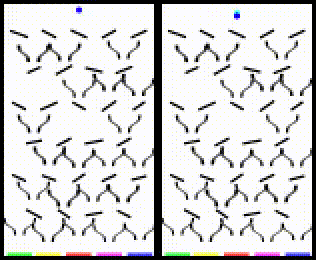

# Adaptive Skip Intervals - Experiments

This repository includes code to reproduce the results in the paper [Adaptive Skip Intervals: Temporal Abstraction for Recurrent Dynamical Models](https://arxiv.org/abs/1808.04768).

```
@article{neitz2018adaptive,
  title={Adaptive Skip Intervals: Temporal Abstraction for Recurrent Dynamical Models},
  author={Neitz, Alexander and Parascandolo, Giambattista and Bauer, Stefan and Sch{\"o}lkopf, Bernhard},
  journal={arXiv preprint arXiv:1808.04768},
  year={2018}
}
```


  
 

The trained model in action: on the left is the ground truth, on the right we see the model's predictions. We synchronized the videos to better compare them. Note that the model skips hard-to-predict frames.


The skipping behavior can also be visualized using timelines. Lines between the frames visualize the frame similarity which is used in the temporal matching step of ASI.
- [Funnel board timeline](img/fubo_145_0_timeline_C_0.png)
- [Room runner timeline](img/rr_315_3_timeline_C_0.png)

Code to generate datasets is available in the separate repository:
https://github.com/neitzal/asi-tasks


## Dependencies
- imageio==2.1.2
- keras==2.1.3
- moviepy==0.2.3.2
- numpy==1.14.0
- pandas==0.22.0
- pillow==5.0.0
- pytest==3.4.0
- scikit-image==0.14.0
- scipy==1.0.0
- tensorflow==1.5.0
- tqdm==4.11.2

## Training the ASI model
To train the ASI model, please run, for example
```
python -m experiment.run_experiment 
    --delta_t_upper_bound 21  
    --exploration_steps 15000
    --optimizer adam 
    --schd_sampling_steps 15000 
    --f_init_learning_rate 0.0005 
    --f_learning_rate_decay_rate 0.2 
    --f_learning_rate_decay_steps 15000 
    --f_architecture f_simple 
    --n_kernels 48 
    --n_trajectories_per_batch 2 
    --z_loss_fn log_loss 
    --initializer he_uniform 
    --activation relu 
    --dataset fubo  
    --n_validation_examples 3 
    --train_filepath /path/to/train.tfrecords 
    --valid_filepath /path/to/valid.tfrecords 
    --n_epochs 150 
    --output_dir /path/to/training_output/
```